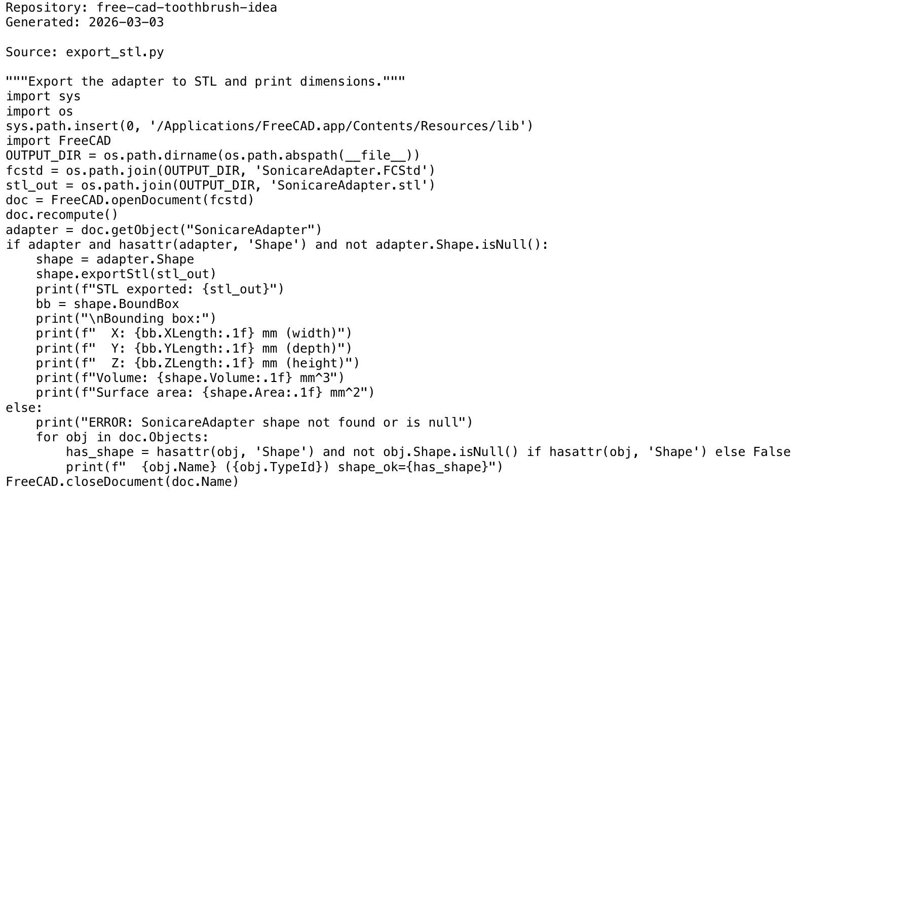

# Project Narrative & Proof

Generated: 2026-03-03

## User Journey
1. Discover the project value in the repository overview and launch instructions.
2. Run or open the build artifact for free-cad-toothbrush-idea and interact with the primary experience.
3. Observe output/behavior through the documented flow and visual/code evidence below.
4. Reuse or extend the project by following the repository structure and stack notes.

## Design Methodology
- Iterative implementation with working increments preserved in Git history.
- Show-don't-tell documentation style: direct assets and source excerpts instead of abstract claims.
- Traceability from concept to implementation through concrete files and modules.

## Progress
- Latest commit: 4d74ac4 (2026-03-02) - docs: add professional README with badges
- Total commits: 5
- Current status: repository has baseline narrative + proof documentation and CI doc validation.

## Tech Stack
- Detected stack: GitHub Actions, Python

## Main Key Concepts
- Key module area: `.claude`
- Key module area: `nvim-portable`
- Key module area: `openspec`

## What I'm Bringing to the Table
- End-to-end ownership: from concept framing to implementation and quality gates.
- Engineering rigor: repeatable workflows, versioned progress, and implementation-first evidence.
- Product clarity: user-centered framing with explicit journey and value articulation.

## Show Don't Tell: Screenshots


## Show Don't Tell: Code Excerpt
Source: `export_stl.py`

```py
"""Export the adapter to STL and print dimensions."""
import sys
import os
sys.path.insert(0, '/Applications/FreeCAD.app/Contents/Resources/lib')
import FreeCAD
OUTPUT_DIR = os.path.dirname(os.path.abspath(__file__))
fcstd = os.path.join(OUTPUT_DIR, 'SonicareAdapter.FCStd')
stl_out = os.path.join(OUTPUT_DIR, 'SonicareAdapter.stl')
doc = FreeCAD.openDocument(fcstd)
doc.recompute()
adapter = doc.getObject("SonicareAdapter")
if adapter and hasattr(adapter, 'Shape') and not adapter.Shape.isNull():
    shape = adapter.Shape
    shape.exportStl(stl_out)
    print(f"STL exported: {stl_out}")
    bb = shape.BoundBox
    print("\nBounding box:")
    print(f"  X: {bb.XLength:.1f} mm (width)")
    print(f"  Y: {bb.YLength:.1f} mm (depth)")
    print(f"  Z: {bb.ZLength:.1f} mm (height)")
    print(f"Volume: {shape.Volume:.1f} mm^3")
    print(f"Surface area: {shape.Area:.1f} mm^2")
else:
    print("ERROR: SonicareAdapter shape not found or is null")
    for obj in doc.Objects:
        has_shape = hasattr(obj, 'Shape') and not obj.Shape.isNull() if hasattr(obj, 'Shape') else False
        print(f"  {obj.Name} ({obj.TypeId}) shape_ok={has_shape}")
FreeCAD.closeDocument(doc.Name)
```
